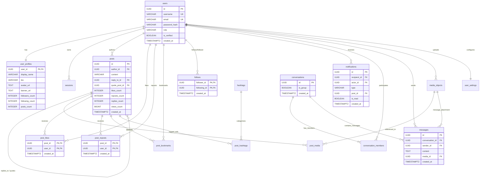

# Database Entity Relationship (ER) Diagram

**Status:** Phase 3 Approved  
**Language:** Mermaid ER Diagram

```mermaid
erDiagram
    users ||--|| user_profiles : "has"
    users ||--o{ sessions : "owns"
    users ||--o{ posts : "authors"
    users ||--o{ post_likes : "likes"
    users ||--o{ post_reposts : "reposts"
    users ||--o{ post_bookmarks : "bookmarks"
    users ||--o{ follows : "follows/follower"
    users ||--o{ notifications : "receives"
    users ||--o{ conversation_members : "participates"
    users ||--o{ messages : "sends"
    users ||--o{ media_objects : "uploads"
    users ||--|| user_settings : "configures"

    posts ||--o{ posts : "replies_to / quotes"
    posts ||--o{ post_media : "contains"
    media_objects ||--o{ post_media : "referenced_in"
    posts ||--o{ post_likes : "receives"
    posts ||--o{ post_reposts : "receives"
    posts ||--o{ post_bookmarks : "receives"
    posts ||--o{ post_hashtags : "tagged_with"
    hashtags ||--o{ post_hashtags : "categorizes"

    conversations ||--|{ conversation_members : "has_members"
    conversations ||--o{ messages : "contains_messages"
    media_objects ||--o{ messages : "message_attachment"

    users {
        UUID id PK
        VARCHAR username UK
        VARCHAR email UK
        VARCHAR password_hash
        VARCHAR role
        BOOLEAN is_verified
        TIMESTAMPTZ created_at
    }

    user_profiles {
        UUID user_id PK, FK
        VARCHAR display_name
        VARCHAR bio
        TEXT avatar_url
        TEXT banner_url
        INTEGER followers_count
        INTEGER following_count
        INTEGER posts_count
    }

    posts {
        UUID id PK
        UUID author_id FK
        VARCHAR content
        UUID reply_to_id FK
        UUID quote_post_id FK
        INTEGER likes_count
        INTEGER reposts_count
        INTEGER replies_count
        BIGINT views_count
        TIMESTAMPTZ created_at
    }

    post_likes {
        UUID post_id PK, FK
        UUID user_id PK, FK
        TIMESTAMPTZ created_at
    }

    post_reposts {
        UUID post_id PK, FK
        UUID user_id PK, FK
        TIMESTAMPTZ created_at
    }

    follows {
        UUID follower_id PK, FK
        UUID following_id PK, FK
        TIMESTAMPTZ created_at
    }

    notifications {
        UUID id PK
        UUID recipient_id FK
        UUID actor_id FK
        VARCHAR type
        UUID post_id FK
        BOOLEAN is_read
        TIMESTAMPTZ created_at
    }

    conversations {
        UUID id PK
        BOOLEAN is_group
        TIMESTAMPTZ created_at
    }

    messages {
        UUID id PK
        UUID conversation_id FK
        UUID sender_id FK
        TEXT content
        UUID media_id FK
        TIMESTAMPTZ created_at
    }
```
